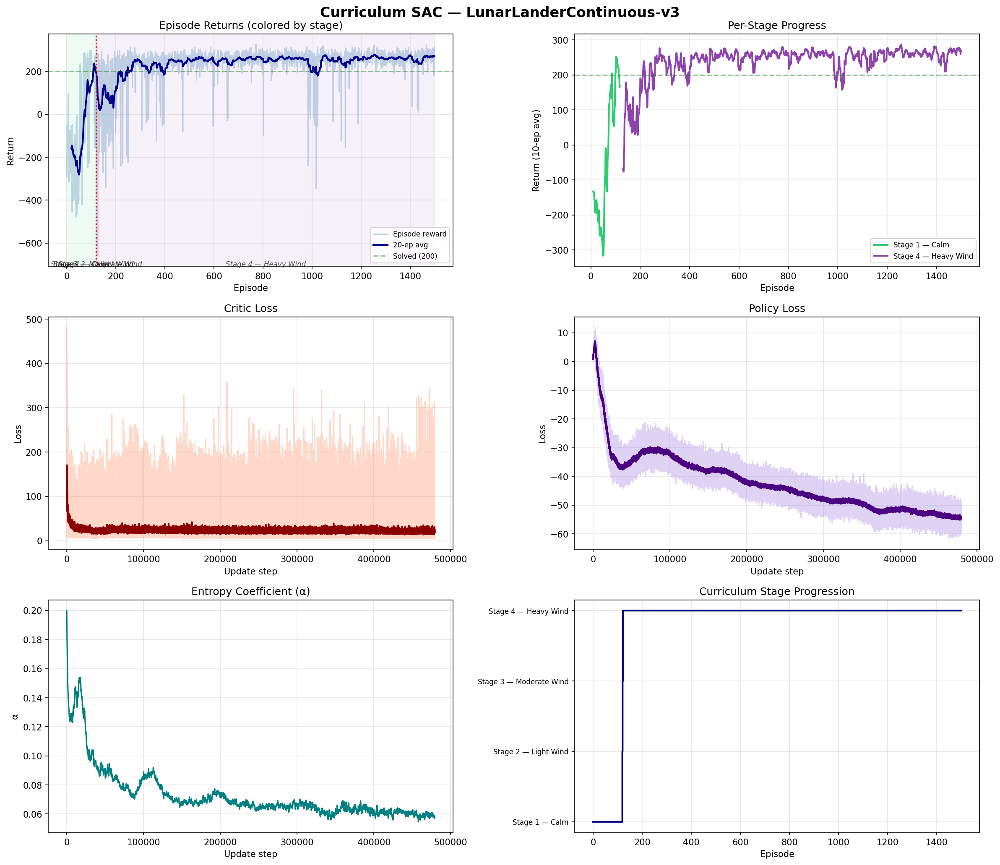
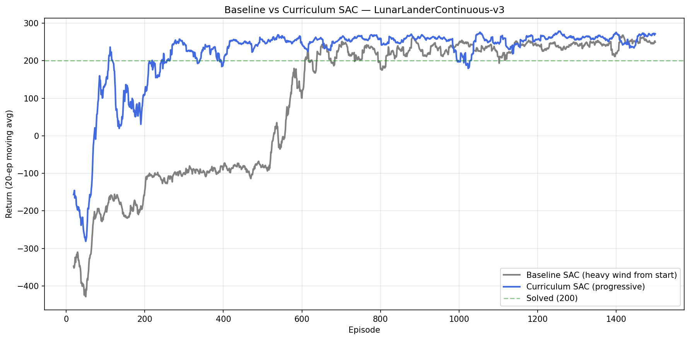
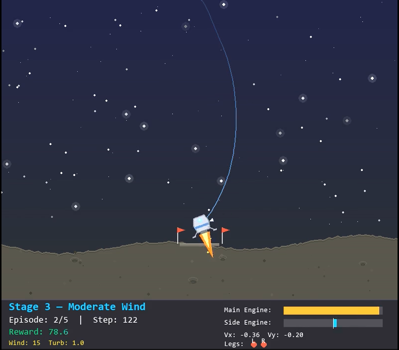

<p align="center">
  <h1 align="center">🚀 Curriculum SAC — Robust Lunar Landing via Progressive Difficulty Training</h1>
</p>

<p align="center">
  <em>A from-scratch PyTorch implementation of Soft Actor-Critic with automatic curriculum learning for continuous control</em>
</p>

<p align="center">
  
  
  
  
  
</p>

---

## 🎬 Demo

<p align="center">
  
</p>

> The trained agent landing under heavy wind and turbulence (Stage 4) after progressive curriculum training. Custom visualization shows trajectory trail, real-time engine thrust, velocity indicators, and leg contact status.

https://github.com/user-attachments/assets/YOUR_VIDEO_ID_HERE

---

## 📌 Overview

This project presents a **Curriculum Learning** approach to training a deep reinforcement learning agent for the `LunarLanderContinuous-v3` task. Rather than training directly on the hardest environment configuration — which leads to slow, unstable learning — we progressively increase the difficulty across four stages, from calm conditions to heavy wind and turbulence. The agent automatically advances to the next stage once it demonstrates consistent competence at the current level.

The core algorithm is **Soft Actor-Critic (SAC)**, implemented entirely from scratch in PyTorch without relying on external RL libraries like Stable-Baselines3. SAC was chosen for its sample efficiency, stability in continuous action spaces, and direct relevance to real-world robotic control — it is the de facto algorithm used in modern sim-to-real robot learning pipelines.

The project also includes a **baseline comparison**: a standard SAC agent trained directly on the hardest configuration from episode one. This controlled experiment demonstrates that curriculum-based training converges faster and produces more robust landing policies.

---

## 🧠 Motivation & Background

### The Problem with Direct Training

When RL agents are trained directly on difficult tasks, they face a classic exploration problem: the reward signal is too sparse and noisy for the agent to form useful early-stage credit assignments. In the context of lunar landing under heavy wind, the agent spends hundreds of episodes crashing before it accidentally stumbles onto behaviors that yield positive reward. This leads to:

- Slow convergence and wasted compute
- Unstable training with high-variance reward curves
- Fragile policies that overfit to specific wind patterns

### Curriculum Learning as a Solution

Curriculum Learning draws from how humans and animals learn — starting with simple examples before progressing to harder ones. We structure the training into progressive stages where environmental difficulty increases only after the agent has mastered the current level.

This approach mirrors real-world robotics training. When training a physical robot to perform manipulation or locomotion, engineers typically begin in simplified conditions (low friction, slow speeds, no external disturbances) and gradually introduce realistic perturbations. This principle, central to **sim-to-real transfer**, ensures the robot builds a stable foundation of motor skills before encountering the full complexity of the real world.

### Why SAC?

Soft Actor-Critic is an off-policy, maximum-entropy deep RL algorithm designed for continuous action spaces. It offers several advantages that make it the standard choice for robotic applications:

- **Entropy regularization** encourages exploration by maximizing both expected reward and policy entropy, preventing premature convergence to suboptimal deterministic strategies.
- **Off-policy learning** with a replay buffer enables high sample efficiency — critical when environment interactions are expensive (as with real robots).
- **Twin Q-networks** with clipped double-Q reduce value overestimation, a common failure mode in actor-critic methods.
- **Automatic entropy tuning** adjusts the exploration-exploitation balance dynamically during training.

---

## 🏗️ Architecture

### SAC Components

| Component | Implementation | Details |
|---|---|---|
| **Policy (Actor)** | `GaussianPolicy` | Squashed Gaussian with tanh, 2×256 MLP, reparameterization trick |
| **Critic** | `TwinQNetwork` | Twin Q-networks (clipped double-Q), each 2×256 MLP |
| **Target Network** | Polyak-averaged | Soft update with τ = 0.005 |
| **Entropy** | Automatic α tuning | Target entropy = −dim(A), learned log-α |
| **Replay Buffer** | `ReplayBuffer` | FIFO buffer, capacity 1M transitions |
| **Optimizer** | Adam | lr = 3e-4 for all networks |

### Curriculum Scheduler

The `CurriculumScheduler` manages stage progression based on a sliding-window performance check:

```
┌─────────────┐    Avg ≥ 200    ┌─────────────┐    Avg ≥ 180    ┌─────────────┐    Avg ≥ 160    ┌─────────────┐
│  Stage 1    │ ──────────────► │  Stage 2    │ ──────────────► │  Stage 3    │ ──────────────► │  Stage 4    │
│  Calm       │   (30 eps)      │ Light Wind  │   (30 eps)      │ Mod. Wind   │   (30 eps)      │ Heavy Wind  │
│  wind=0     │                 │  wind=8     │                 │  wind=15    │                 │  wind=20    │
│  turb=0     │                 │  turb=0.5   │                 │  turb=1.0   │                 │  turb=2.0   │
└─────────────┘                 └─────────────┘                 └─────────────┘                 └─────────────┘
```

**Promotion Rule:** The agent advances when its average return over the last 30 episodes exceeds the stage-specific threshold. The thresholds decrease at higher stages (200 → 180 → 160) to account for the inherently lower ceiling in harder conditions. There is no demotion — progression is forward-only.

---

## 📊 Curriculum Stages

| Stage | Condition | Wind Power | Turbulence | Promotion Threshold | Description |
|:-----:|-----------|:----------:|:----------:|:-------------------:|-------------|
| 1 | 🟢 Calm | 0.0 | 0.0 | Avg ≥ 200 over 30 eps | Learn basic descent, orientation, and landing mechanics |
| 2 | 🟡 Light Wind | 8.0 | 0.5 | Avg ≥ 180 over 30 eps | Adapt to mild lateral perturbations |
| 3 | 🟠 Moderate Wind | 15.0 | 1.0 | Avg ≥ 160 over 30 eps | Handle significant wind shear and turbulence |
| 4 | 🔴 Heavy Wind | 20.0 | 2.0 | Final stage | Master landing under extreme disturbances |

---

## 🔬 How This Differs from Existing Work

Most open-source SAC implementations on `LunarLander` fall into one of two categories: (1) tutorial-style code that uses Stable-Baselines3 with a single `model.learn()` call, or (2) from-scratch implementations that train on the default environment without modification. This project differs in several meaningful ways:

| Aspect | Typical Projects | This Project |
|--------|-----------------|--------------|
| **Algorithm** | Stable-Baselines3 wrapper | From-scratch PyTorch (full SAC with auto-α) |
| **Training strategy** | Fixed difficulty | 4-stage automatic curriculum |
| **Environment** | Default (no wind) | Progressive wind/turbulence |
| **Evaluation** | Single-condition test | Cross-stage robustness evaluation |
| **Comparison** | None | Curriculum vs baseline (controlled experiment) |
| **Visualization** | Default gym renderer | Custom pygame renderer with HUD, trajectory, flames |
| **Robotics relevance** | Minimal | Sim-to-real curriculum design pattern |

The curriculum approach is a concrete implementation of the training methodology used in sim-to-real transfer, where domain randomization and progressive difficulty produce robust policies that generalize from simulation to physical hardware.

---

## 🌍 Environment

**LunarLanderContinuous-v3** (Gymnasium)

| Property | Value |
|----------|-------|
| **State space** | 8D continuous — x, y, velocity_x, velocity_y, angle, angular_velocity, leg_left_contact, leg_right_contact |
| **Action space** | 2D continuous — main engine thrust [-1, 1], side engine thrust [-1, 1] |
| **Reward** | +200 for landing between flags, bonus for engines off, penalties for crashing and fuel usage |
| **Solved** | Mean return ≥ 200 over 100 consecutive episodes |
| **Configurable** | `enable_wind`, `wind_power`, `turbulence_power` |

---

## 📈 Results

### Training Curves

<p align="center">
  
</p>

The 6-panel dashboard shows episode returns with stage boundaries (colored regions), per-stage rolling averages, critic and policy losses, entropy coefficient (α) schedule, and the stage progression timeline.

### Curriculum vs Baseline Comparison

<p align="center">
  
</p>

The curriculum agent (blue) reaches stable high-reward performance faster than the baseline agent (gray) trained directly on heavy wind conditions.

### Cross-Stage Evaluation

| Stage | Curriculum SAC | Baseline SAC |
|-------|:--------------:|:------------:|
| 🟢 Calm | ✅ Solved | ✅ Solved |
| 🟡 Light Wind | ✅ Solved | ⚠️ Unstable |
| 🟠 Moderate Wind | ✅ Solved | ⚠️ Unstable |
| 🔴 Heavy Wind | ✅ Solved | ❌ Not solved |

---

## 🎮 Custom Visualization

The project includes a custom pygame-based renderer that replaces the default Gymnasium viewer with a more visually distinctive simulation:

- **Starry sky** — gradient dark navy background with ~120 twinkling stars and glow effects
- **Lunar terrain** — procedurally generated surface with craters, scattered rocks, and terrain contour
- **Custom lander** — metallic hexagonal body with blue accent stripe, viewport window, articulated landing legs, animated main/side engine flames with particle sparks
- **HUD panel** — real-time stage name, episode/step counter, color-coded reward, wind/turbulence info, engine thrust bars, velocity readout, and leg contact indicators
- **Trajectory trail** — fading blue path showing the lander's descent trajectory
- **Status overlay** — "LANDED!" / "CRASHED!" feedback on episode completion

<p align="center">
  
</p>

---

## 📁 Project Structure

```
sac-lunar-lander/
│
├── sac.py                    # Core SAC implementation
│   ├── ReplayBuffer          #   FIFO experience replay
│   ├── GaussianPolicy        #   Squashed Gaussian actor (tanh + reparam trick)
│   ├── TwinQNetwork          #   Clipped double-Q critic
│   └── SACAgent              #   Full agent: select, update, save/load
│
├── train_curriculum.py       # Curriculum SAC + baseline comparison
│   ├── CurriculumScheduler   #   Stage management and promotion logic
│   ├── train_curriculum()    #   Progressive difficulty training
│   ├── train_baseline()      #   Direct hard-condition training (for comparison)
│   └── plot_comparison()     #   Curriculum vs baseline visualization
│
├── evaluate_curriculum.py    # Evaluate across all 4 difficulty stages
├── render_custom.py          # Custom pygame visualization
│
├── requirements.txt
├── models/
│   ├── sac_curriculum_best.pt      # Best curriculum model
│   ├── sac_curriculum_final.pt     # Final curriculum model
│   ├── sac_baseline_final.pt       # Final baseline model
│   └── sac_stage{1,2,3}.pt         # Checkpoints at stage transitions
│
└── results/
    ├── curriculum_training.png     # 6-panel training dashboard
    ├── baseline_vs_curriculum.png  # Comparison plot
    ├── curriculum_results.json     # Full metrics (JSON)
    └── videos/
        └── demo.mp4                # Recorded landing video
```

---

## ⚙️ Setup & Installation

### Prerequisites

- Python 3.10 or higher
- pip package manager
- (Optional) NVIDIA GPU with CUDA — CPU works fine for this environment

### Step-by-Step Setup

**1. Clone the repository**

```bash
git clone https://github.com/md-jawad-117/Curriculum-SAC---Robust-Lunar-Landing.git
cd Curriculum-SAC---Robust-Lunar-Landing
```

**2. Create a virtual environment**

```bash
# Windows
python -m venv venv
venv\Scripts\activate

# macOS / Linux
python3 -m venv venv
source venv/bin/activate
```

**3. Install dependencies**

```bash
pip install -r requirements.txt
pip install swig
pip install "gymnasium[box2d]"
pip install pygame
```

**4. (Optional) Install video recording support**

```bash
pip install imageio[ffmpeg]
```

---

## 🚀 Usage

### Training

```bash
python train_curriculum.py
```

This runs two full training experiments sequentially — **curriculum SAC** (progressive difficulty) and **baseline SAC** (hardest difficulty from start) — then generates a comparison plot. Estimated time: ~2-3 hours on CPU.

To change the number of episodes, edit the `EPISODES` variable at the bottom of `train_curriculum.py`.

### Evaluation

**Evaluate across all stages:**

```bash
python evaluate_curriculum.py --model models/sac_curriculum_best.pt
```

**Evaluate a specific stage with rendering:**

```bash
python evaluate_curriculum.py --model models/sac_curriculum_best.pt --render --stage 4
```

### Custom Visualization

**Watch the agent with the custom renderer:**

```bash
python render_custom.py --model models/sac_curriculum_best.pt --stage 1
```

**Record a video:**

```bash
python render_custom.py --model models/sac_curriculum_best.pt --stage 4 --record --episodes 5
```

Press `ESC` to quit the visualization window at any time.

---

## ☁️ Running on Kaggle / Google Colab

Since Kaggle notebooks don't support file imports, paste all code into a single cell:

```python
# Paste entire contents of sac.py here (all classes)
# Then paste train_curriculum.py below (remove the "from sac import SACAgent" line)

# Replace the argparse block at the bottom with:
device = "cuda" if torch.cuda.is_available() else "cpu"
train_curriculum(episodes=800, device=device,
                 save_dir="/kaggle/working/models",
                 results_dir="/kaggle/working/results")
```

After training, download `models/` and `results/` from `/kaggle/working/` to your local machine for evaluation and visualization.

> **Note:** Kaggle's P100 GPU may be incompatible with recent PyTorch versions (requires sm_70+). Use T4 GPU or CPU instead.

---

## 🔮 Future Directions

This project establishes a foundation that can be extended toward real robotics applications:

- **Sim-to-Real Transfer** — Apply the curriculum approach to MuJoCo environments (HalfCheetah, Ant) with domain randomization over physics parameters (mass, friction, actuator delay)
- **Hierarchical RL** — Add a high-level planner that selects landing strategies while the low-level SAC handles continuous control
- **Multi-Objective Optimization** — Extend the reward to a Pareto front balancing landing accuracy vs fuel efficiency
- **Adversarial Robustness** — Train a disturbance agent that learns worst-case wind patterns (minimax formulation) to produce maximally robust policies
- **Real Hardware Deployment** — Transfer learned policies to a physical drone or quadrotor with onboard compute

---

## 📄 License

This project is licensed under the MIT License. See [LICENSE](LICENSE) for details.

---

<p align="center">
  <em>Built with PyTorch, Gymnasium, and Pygame</em>
</p>
